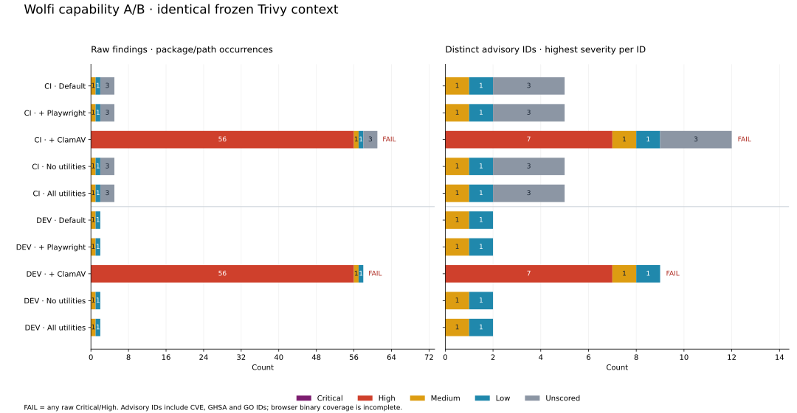
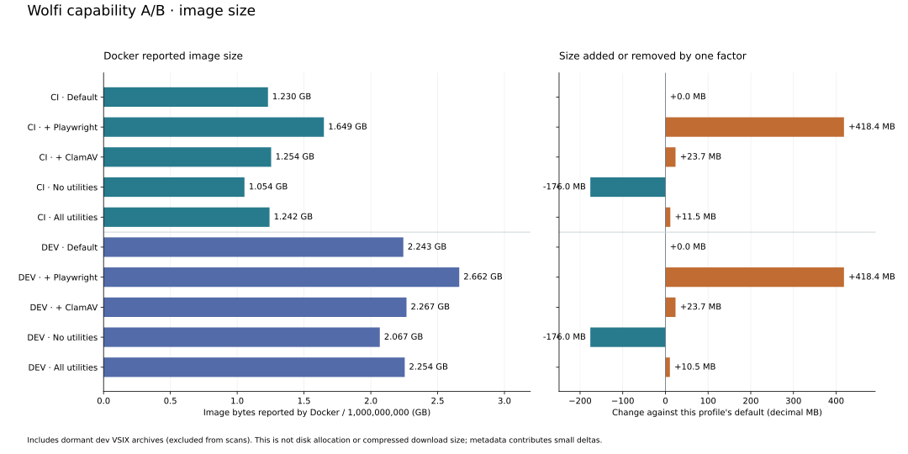

# Wolfi capability A/B — 2026-09-05

Verified 2026-09-05T13:49:26Z; platform `linux/amd64`.

Each change is compared with its own CI or dev default. These are independent single-factor experiments; the Playwright, ClamAV and full-utilities additions are not combined.

`utilities-none` removes every explicit utility selector, including kubectl, Helm, ORAS and MongoDB clients. Required transitive packages can remain. `utilities-all` enables every reviewed catalog utility except ClamAV, which is its own experiment. Shipped defaults are unchanged.





| Profile | Change | Gate | Size GB | Δ MB | Critical | High | Medium | Low | Unscored | Distinct IDs | APKs |
| --- | --- | --- | ---: | ---: | ---: | ---: | ---: | ---: | ---: | ---: | ---: |
| CI | Default | **PASS** | 1.230 | +0.0 | 0 | 0 | 1 | 1 | 3 | 5 | 148 |
| CI | + Playwright | **PASS** | 1.649 | +418.4 | 0 | 0 | 1 | 1 | 3 | 5 | 204 |
| CI | + ClamAV | **FAIL** | 1.254 | +23.7 | 0 | 56 | 1 | 1 | 3 | 12 | 158 |
| CI | No utilities | **PASS** | 1.054 | -176.0 | 0 | 0 | 1 | 1 | 3 | 5 | 132 |
| CI | All utilities | **PASS** | 1.242 | +11.5 | 0 | 0 | 1 | 1 | 3 | 5 | 176 |
| DEV | Default | **PASS** | 2.243 | +0.0 | 0 | 0 | 1 | 1 | 0 | 2 | 160 |
| DEV | + Playwright | **PASS** | 2.662 | +418.4 | 0 | 0 | 1 | 1 | 0 | 2 | 216 |
| DEV | + ClamAV | **FAIL** | 2.267 | +23.7 | 0 | 56 | 1 | 1 | 0 | 9 | 170 |
| DEV | No utilities | **PASS** | 2.067 | -176.0 | 0 | 0 | 1 | 1 | 0 | 2 | 144 |
| DEV | All utilities | **PASS** | 2.254 | +10.5 | 0 | 0 | 1 | 1 | 0 | 2 | 185 |

Severity columns count raw package/path occurrences, including unfixed findings. Distinct IDs count each CVE/GHSA/GO identifier once per image, using its highest observed severity. Different advisory aliases are not merged. A zero Critical/High gate is not a claim of no vulnerabilities; lower and unscored findings require review.

## Changes against each profile's default

| Profile | Change | Controlled resolution | Added IDs | Removed IDs | APKs added / removed |
| --- | --- | --- | --- | --- | ---: |
| CI | + Playwright | Yes | None | None | 56 / 0 |
| CI | + ClamAV | Yes | CVE-2026-20337, CVE-2026-20338, CVE-2026-20339, CVE-2026-20345, CVE-2026-20346, CVE-2026-20347, CVE-2026-20348 | None | 10 / 0 |
| CI | No utilities | Yes | None | None | 0 / 16 |
| CI | All utilities | Yes | None | None | 28 / 0 |
| DEV | + Playwright | Yes | None | None | 56 / 0 |
| DEV | + ClamAV | Yes | CVE-2026-20337, CVE-2026-20338, CVE-2026-20339, CVE-2026-20345, CVE-2026-20346, CVE-2026-20347, CVE-2026-20348 | None | 10 / 0 |
| DEV | No utilities | Yes | None | None | 0 / 16 |
| DEV | All utilities | Yes | None | None | 25 / 0 |

### CI: + Playwright

Repository snapshot provenance: main signed index indexSha256 changed. Snapshot changes alone do not change installed inputs; shared base/APK/vendor bytes are checked separately.

APKs added: `Xvfb=21.1.24-r2`, `at-spi2-core=2.61.90-r1`, `cairo=1.18.4-r8`, `cups-libs=2.4.19-r2`, `dbus-libs=1.16.2-r6`, `font-liberation=2.1.5-r5`, `font-noto-cjk=0.0_git20220127-r2`, `font-noto-common=2026.09.01-r0`, `font-noto-emoji=2.051-r2`, `font-noto-thai=2026.09.01-r0`, `fontconfig=2.18.3-r1`, `fontconfig-config=2.18.3-r1`, `fribidi=1.0.16-r9`, `glib=2.89.4-r1`, `graphite2=1.3.15-r2`, `harfbuzz=14.4.0-r1`, `libatk-1.0=2.61.90-r1`, `libatk-bridge-2.0=2.61.90-r1`, `libblkid=2.42.3-r0`, `libdrm-libs=2.4.134-r2`, `libelf=0.195-r3`, `libfontconfig1=2.18.3-r1`, `libfontenc=1.1.9-r2`, `libglvnd=1.7.0-r11`, `libice=1.1.2-r7`, `libmount=2.42.3-r0`, `libnspr=4.40-r1`, `libnss=3.128-r2`, `libpciaccess=0.19-r3`, `libsm=1.2.6-r5`, `libsystemd=261.2-r3`, `libsystemd-compression-libs=261.2-r3`, `libudev=261.2-r3`, `libxcomposite=0.4.7-r4`, `libxdamage=1.1.7-r4`, `libxfixes=6.0.2-r3`, `libxfont=2.0.9-r1`, `libxft=2.3.9-r7`, `libxkb=1.2.0-r1`, `libxkbcommon=1.13.2-r2`, `libxmu=1.3.1-r5`, `libxrandr=1.5.5-r6`, `libxshmfence=1.3.3-r4`, `libxt=1.3.1-r8`, `lz4=1.10.0-r10`, `mcookie=2.42.3-r0`, `mesa-gbm=26.2.2-r0`, `mesa-libgallium=26.2.2-r0`, `pango=1.58.2-r1`, `pixman=0.46.4-r6`, `wayland-libs-client=1.26.0-r1`, `xauth=1.1.5-r3`, `xkbcomp=1.5.0-r4`, `xkeyboard-config=2.48-r2`, `xvfb-run=21.1.24-r2`, `zstd=1.5.7-r10`.

APKs removed: none.


### CI: + ClamAV

Repository snapshot provenance: extra signed index indexSha256 changed; main signed index indexSha256 changed. Snapshot changes alone do not change installed inputs; shared base/APK/vendor bytes are checked separately.

APKs added: `clamav-1.5=1.5.2-r7`, `clamav-1.5-clamdscan=1.5.2-r7`, `clamav-1.5-daemon=1.5.2-r7`, `clamav-1.5-db=1.5.2-r7`, `clamav-1.5-freshclam=1.5.2-r7`, `clamav-1.5-libunrar=1.5.2-r7`, `clamav-1.5-milter=1.5.2-r7`, `clamav-1.5-scanner=1.5.2-r7`, `json-c=0.19-r1`, `libmspack=1.11-r0`.

APKs removed: none.

| Advisory | Severity | Package | Installed | Fixed | Description |
| --- | --- | --- | --- | --- | --- |
| CVE-2026-20337 | HIGH | clamav-1.5 | 1.5.2-r7 | 1.5.4-r0 | CVE-2026-20337 affecting package clamav for versions less than 1.5.4-1 |
| CVE-2026-20337 | HIGH | clamav-1.5-clamdscan | 1.5.2-r7 | 1.5.4-r0 | CVE-2026-20337 affecting package clamav for versions less than 1.5.4-1 |
| CVE-2026-20337 | HIGH | clamav-1.5-daemon | 1.5.2-r7 | 1.5.4-r0 | CVE-2026-20337 affecting package clamav for versions less than 1.5.4-1 |
| CVE-2026-20337 | HIGH | clamav-1.5-db | 1.5.2-r7 | 1.5.4-r0 | CVE-2026-20337 affecting package clamav for versions less than 1.5.4-1 |
| CVE-2026-20337 | HIGH | clamav-1.5-freshclam | 1.5.2-r7 | 1.5.4-r0 | CVE-2026-20337 affecting package clamav for versions less than 1.5.4-1 |
| CVE-2026-20337 | HIGH | clamav-1.5-libunrar | 1.5.2-r7 | 1.5.4-r0 | CVE-2026-20337 affecting package clamav for versions less than 1.5.4-1 |
| CVE-2026-20337 | HIGH | clamav-1.5-milter | 1.5.2-r7 | 1.5.4-r0 | CVE-2026-20337 affecting package clamav for versions less than 1.5.4-1 |
| CVE-2026-20337 | HIGH | clamav-1.5-scanner | 1.5.2-r7 | 1.5.4-r0 | CVE-2026-20337 affecting package clamav for versions less than 1.5.4-1 |
| CVE-2026-20338 | HIGH | clamav-1.5 | 1.5.2-r7 | 1.5.4-r0 | CVE-2026-20338 affecting package clamav for versions less than 1.5.4-1 |
| CVE-2026-20338 | HIGH | clamav-1.5-clamdscan | 1.5.2-r7 | 1.5.4-r0 | CVE-2026-20338 affecting package clamav for versions less than 1.5.4-1 |
| CVE-2026-20338 | HIGH | clamav-1.5-daemon | 1.5.2-r7 | 1.5.4-r0 | CVE-2026-20338 affecting package clamav for versions less than 1.5.4-1 |
| CVE-2026-20338 | HIGH | clamav-1.5-db | 1.5.2-r7 | 1.5.4-r0 | CVE-2026-20338 affecting package clamav for versions less than 1.5.4-1 |
| CVE-2026-20338 | HIGH | clamav-1.5-freshclam | 1.5.2-r7 | 1.5.4-r0 | CVE-2026-20338 affecting package clamav for versions less than 1.5.4-1 |
| CVE-2026-20338 | HIGH | clamav-1.5-libunrar | 1.5.2-r7 | 1.5.4-r0 | CVE-2026-20338 affecting package clamav for versions less than 1.5.4-1 |
| CVE-2026-20338 | HIGH | clamav-1.5-milter | 1.5.2-r7 | 1.5.4-r0 | CVE-2026-20338 affecting package clamav for versions less than 1.5.4-1 |
| CVE-2026-20338 | HIGH | clamav-1.5-scanner | 1.5.2-r7 | 1.5.4-r0 | CVE-2026-20338 affecting package clamav for versions less than 1.5.4-1 |
| CVE-2026-20339 | HIGH | clamav-1.5 | 1.5.2-r7 | 1.5.4-r0 | A vulnerability in the PESpin file format parser of ClamAV could allow ... |
| CVE-2026-20339 | HIGH | clamav-1.5-clamdscan | 1.5.2-r7 | 1.5.4-r0 | A vulnerability in the PESpin file format parser of ClamAV could allow ... |
| CVE-2026-20339 | HIGH | clamav-1.5-daemon | 1.5.2-r7 | 1.5.4-r0 | A vulnerability in the PESpin file format parser of ClamAV could allow ... |
| CVE-2026-20339 | HIGH | clamav-1.5-db | 1.5.2-r7 | 1.5.4-r0 | A vulnerability in the PESpin file format parser of ClamAV could allow ... |
| CVE-2026-20339 | HIGH | clamav-1.5-freshclam | 1.5.2-r7 | 1.5.4-r0 | A vulnerability in the PESpin file format parser of ClamAV could allow ... |
| CVE-2026-20339 | HIGH | clamav-1.5-libunrar | 1.5.2-r7 | 1.5.4-r0 | A vulnerability in the PESpin file format parser of ClamAV could allow ... |
| CVE-2026-20339 | HIGH | clamav-1.5-milter | 1.5.2-r7 | 1.5.4-r0 | A vulnerability in the PESpin file format parser of ClamAV could allow ... |
| CVE-2026-20339 | HIGH | clamav-1.5-scanner | 1.5.2-r7 | 1.5.4-r0 | A vulnerability in the PESpin file format parser of ClamAV could allow ... |
| CVE-2026-20345 | HIGH | clamav-1.5 | 1.5.2-r7 | 1.5.4-r0 | A vulnerability in the GPT file format parser of ClamAV could allow an ... |
| CVE-2026-20345 | HIGH | clamav-1.5-clamdscan | 1.5.2-r7 | 1.5.4-r0 | A vulnerability in the GPT file format parser of ClamAV could allow an ... |
| CVE-2026-20345 | HIGH | clamav-1.5-daemon | 1.5.2-r7 | 1.5.4-r0 | A vulnerability in the GPT file format parser of ClamAV could allow an ... |
| CVE-2026-20345 | HIGH | clamav-1.5-db | 1.5.2-r7 | 1.5.4-r0 | A vulnerability in the GPT file format parser of ClamAV could allow an ... |
| CVE-2026-20345 | HIGH | clamav-1.5-freshclam | 1.5.2-r7 | 1.5.4-r0 | A vulnerability in the GPT file format parser of ClamAV could allow an ... |
| CVE-2026-20345 | HIGH | clamav-1.5-libunrar | 1.5.2-r7 | 1.5.4-r0 | A vulnerability in the GPT file format parser of ClamAV could allow an ... |
| CVE-2026-20345 | HIGH | clamav-1.5-milter | 1.5.2-r7 | 1.5.4-r0 | A vulnerability in the GPT file format parser of ClamAV could allow an ... |
| CVE-2026-20345 | HIGH | clamav-1.5-scanner | 1.5.2-r7 | 1.5.4-r0 | A vulnerability in the GPT file format parser of ClamAV could allow an ... |
| CVE-2026-20346 | HIGH | clamav-1.5 | 1.5.2-r7 | 1.5.4-r0 | A vulnerability in the PDF file format parser of ClamAV could allow an ... |
| CVE-2026-20346 | HIGH | clamav-1.5-clamdscan | 1.5.2-r7 | 1.5.4-r0 | A vulnerability in the PDF file format parser of ClamAV could allow an ... |
| CVE-2026-20346 | HIGH | clamav-1.5-daemon | 1.5.2-r7 | 1.5.4-r0 | A vulnerability in the PDF file format parser of ClamAV could allow an ... |
| CVE-2026-20346 | HIGH | clamav-1.5-db | 1.5.2-r7 | 1.5.4-r0 | A vulnerability in the PDF file format parser of ClamAV could allow an ... |
| CVE-2026-20346 | HIGH | clamav-1.5-freshclam | 1.5.2-r7 | 1.5.4-r0 | A vulnerability in the PDF file format parser of ClamAV could allow an ... |
| CVE-2026-20346 | HIGH | clamav-1.5-libunrar | 1.5.2-r7 | 1.5.4-r0 | A vulnerability in the PDF file format parser of ClamAV could allow an ... |
| CVE-2026-20346 | HIGH | clamav-1.5-milter | 1.5.2-r7 | 1.5.4-r0 | A vulnerability in the PDF file format parser of ClamAV could allow an ... |
| CVE-2026-20346 | HIGH | clamav-1.5-scanner | 1.5.2-r7 | 1.5.4-r0 | A vulnerability in the PDF file format parser of ClamAV could allow an ... |
| CVE-2026-20347 | HIGH | clamav-1.5 | 1.5.2-r7 | 1.5.4-r0 | A vulnerability in the Mach-O file format parser of ClamAV could allow ... |
| CVE-2026-20347 | HIGH | clamav-1.5-clamdscan | 1.5.2-r7 | 1.5.4-r0 | A vulnerability in the Mach-O file format parser of ClamAV could allow ... |
| CVE-2026-20347 | HIGH | clamav-1.5-daemon | 1.5.2-r7 | 1.5.4-r0 | A vulnerability in the Mach-O file format parser of ClamAV could allow ... |
| CVE-2026-20347 | HIGH | clamav-1.5-db | 1.5.2-r7 | 1.5.4-r0 | A vulnerability in the Mach-O file format parser of ClamAV could allow ... |
| CVE-2026-20347 | HIGH | clamav-1.5-freshclam | 1.5.2-r7 | 1.5.4-r0 | A vulnerability in the Mach-O file format parser of ClamAV could allow ... |
| CVE-2026-20347 | HIGH | clamav-1.5-libunrar | 1.5.2-r7 | 1.5.4-r0 | A vulnerability in the Mach-O file format parser of ClamAV could allow ... |
| CVE-2026-20347 | HIGH | clamav-1.5-milter | 1.5.2-r7 | 1.5.4-r0 | A vulnerability in the Mach-O file format parser of ClamAV could allow ... |
| CVE-2026-20347 | HIGH | clamav-1.5-scanner | 1.5.2-r7 | 1.5.4-r0 | A vulnerability in the Mach-O file format parser of ClamAV could allow ... |
| CVE-2026-20348 | HIGH | clamav-1.5 | 1.5.2-r7 | 1.5.4-r0 | A vulnerability in the XAR file format parser of ClamAV could allow an ... |
| CVE-2026-20348 | HIGH | clamav-1.5-clamdscan | 1.5.2-r7 | 1.5.4-r0 | A vulnerability in the XAR file format parser of ClamAV could allow an ... |
| CVE-2026-20348 | HIGH | clamav-1.5-daemon | 1.5.2-r7 | 1.5.4-r0 | A vulnerability in the XAR file format parser of ClamAV could allow an ... |
| CVE-2026-20348 | HIGH | clamav-1.5-db | 1.5.2-r7 | 1.5.4-r0 | A vulnerability in the XAR file format parser of ClamAV could allow an ... |
| CVE-2026-20348 | HIGH | clamav-1.5-freshclam | 1.5.2-r7 | 1.5.4-r0 | A vulnerability in the XAR file format parser of ClamAV could allow an ... |
| CVE-2026-20348 | HIGH | clamav-1.5-libunrar | 1.5.2-r7 | 1.5.4-r0 | A vulnerability in the XAR file format parser of ClamAV could allow an ... |
| CVE-2026-20348 | HIGH | clamav-1.5-milter | 1.5.2-r7 | 1.5.4-r0 | A vulnerability in the XAR file format parser of ClamAV could allow an ... |
| CVE-2026-20348 | HIGH | clamav-1.5-scanner | 1.5.2-r7 | 1.5.4-r0 | A vulnerability in the XAR file format parser of ClamAV could allow an ... |


### CI: No utilities

Repository snapshot provenance: extra signed index indexSha256 changed; main signed index indexSha256 changed. Snapshot changes alone do not change installed inputs; shared base/APK/vendor bytes are checked separately.

APKs added: none.

APKs removed: `curl=8.22.0-r0`, `findutils=4.11.0-r2`, `helm-4=4.2.4-r3`, `less=709-r1`, `libedit=3.1-r19`, `libproc-2-0=4.0.7-r1`, `mongo-tools=100.18.0-r6`, `mongosh=2.10.0-r1`, `openssh-client=10.5_p1-r1`, `openssh-keygen=10.5_p1-r1`, `openssh-keyscan=10.5_p1-r1`, `oras=1.3.4-r0`, `procps=4.0.7-r1`, `unzip=6.0-r8`, `yq=4.53.6-r2`, `zip=3.0-r11`.


### CI: All utilities

Repository snapshot provenance: extra signed index indexSha256 changed. Snapshot changes alone do not change installed inputs; shared base/APK/vendor bytes are checked separately.

APKs added: `bind-libs=9.20.27-r1`, `bind-tools=9.20.27-r1`, `db=5.3.33-r1`, `fstrm=0.6.1-r6`, `iproute2=7.2.0-r0`, `iptables=1.8.13-r4`, `iputils=20250605-r6`, `json-c=0.19-r1`, `libbpf=1.7.0-r4`, `libbsd=0.12.2-r8`, `libcap=2.78-r3`, `libelf=0.195-r3`, `libev=4.33-r13`, `libmd=1.2.0-r3`, `libmnl=1.0.5-r8`, `libnftnl=1.3.2-r0`, `libtirpc=1.3.7-r6`, `liburcu=0.15.6-r3`, `linux-pam=1.7.2-r5`, `nano=9.2-r1`, `netcat-openbsd=1.238-r1`, `nghttp2=1.70.0-r3`, `nghttp2-dev=1.70.0-r3`, `popt=1.19-r11`, `protobuf-c=1.5.2-r9`, `rsync=3.5.0-r1`, `wget=1.25.0-r16`, `xxhash-libs=0.8.3-r6`.

APKs removed: none.


### DEV: + Playwright

VSIX archive packaging: VSIX payload hashes, versions, classifications and order match; the aggregate archive embeds refreshed resolution metadata/cache paths. Its compressed archive size changes by +3 bytes; these metadata bytes are included in Docker's size delta. Exact before/after archive hashes are preserved in summary.json.

APKs added: `Xvfb=21.1.24-r2`, `at-spi2-core=2.61.90-r1`, `cairo=1.18.4-r8`, `cups-libs=2.4.19-r2`, `dbus-libs=1.16.2-r6`, `font-liberation=2.1.5-r5`, `font-noto-cjk=0.0_git20220127-r2`, `font-noto-common=2026.09.01-r0`, `font-noto-emoji=2.051-r2`, `font-noto-thai=2026.09.01-r0`, `fontconfig=2.18.3-r1`, `fontconfig-config=2.18.3-r1`, `fribidi=1.0.16-r9`, `glib=2.89.4-r1`, `graphite2=1.3.15-r2`, `harfbuzz=14.4.0-r1`, `libatk-1.0=2.61.90-r1`, `libatk-bridge-2.0=2.61.90-r1`, `libblkid=2.42.3-r0`, `libdrm-libs=2.4.134-r2`, `libelf=0.195-r3`, `libfontconfig1=2.18.3-r1`, `libfontenc=1.1.9-r2`, `libglvnd=1.7.0-r11`, `libice=1.1.2-r7`, `libmount=2.42.3-r0`, `libnspr=4.40-r1`, `libnss=3.128-r2`, `libpciaccess=0.19-r3`, `libsm=1.2.6-r5`, `libsystemd=261.2-r3`, `libsystemd-compression-libs=261.2-r3`, `libudev=261.2-r3`, `libxcomposite=0.4.7-r4`, `libxdamage=1.1.7-r4`, `libxfixes=6.0.2-r3`, `libxfont=2.0.9-r1`, `libxft=2.3.9-r7`, `libxkb=1.2.0-r1`, `libxkbcommon=1.13.2-r2`, `libxmu=1.3.1-r5`, `libxrandr=1.5.5-r6`, `libxshmfence=1.3.3-r4`, `libxt=1.3.1-r8`, `lz4=1.10.0-r10`, `mcookie=2.42.3-r0`, `mesa-gbm=26.2.2-r0`, `mesa-libgallium=26.2.2-r0`, `pango=1.58.2-r1`, `pixman=0.46.4-r6`, `wayland-libs-client=1.26.0-r1`, `xauth=1.1.5-r3`, `xkbcomp=1.5.0-r4`, `xkeyboard-config=2.48-r2`, `xvfb-run=21.1.24-r2`, `zstd=1.5.7-r10`.

APKs removed: none.


### DEV: + ClamAV

Repository snapshot provenance: extra signed index indexSha256 changed; main signed index indexSha256 changed. Snapshot changes alone do not change installed inputs; shared base/APK/vendor bytes are checked separately.

VSIX archive packaging: VSIX payload hashes, versions, classifications and order match; the aggregate archive embeds refreshed resolution metadata/cache paths. Its compressed archive size changes by +1 bytes; these metadata bytes are included in Docker's size delta. Exact before/after archive hashes are preserved in summary.json.

APKs added: `clamav-1.5=1.5.2-r7`, `clamav-1.5-clamdscan=1.5.2-r7`, `clamav-1.5-daemon=1.5.2-r7`, `clamav-1.5-db=1.5.2-r7`, `clamav-1.5-freshclam=1.5.2-r7`, `clamav-1.5-libunrar=1.5.2-r7`, `clamav-1.5-milter=1.5.2-r7`, `clamav-1.5-scanner=1.5.2-r7`, `json-c=0.19-r1`, `libmspack=1.11-r0`.

APKs removed: none.

| Advisory | Severity | Package | Installed | Fixed | Description |
| --- | --- | --- | --- | --- | --- |
| CVE-2026-20337 | HIGH | clamav-1.5 | 1.5.2-r7 | 1.5.4-r0 | CVE-2026-20337 affecting package clamav for versions less than 1.5.4-1 |
| CVE-2026-20337 | HIGH | clamav-1.5-clamdscan | 1.5.2-r7 | 1.5.4-r0 | CVE-2026-20337 affecting package clamav for versions less than 1.5.4-1 |
| CVE-2026-20337 | HIGH | clamav-1.5-daemon | 1.5.2-r7 | 1.5.4-r0 | CVE-2026-20337 affecting package clamav for versions less than 1.5.4-1 |
| CVE-2026-20337 | HIGH | clamav-1.5-db | 1.5.2-r7 | 1.5.4-r0 | CVE-2026-20337 affecting package clamav for versions less than 1.5.4-1 |
| CVE-2026-20337 | HIGH | clamav-1.5-freshclam | 1.5.2-r7 | 1.5.4-r0 | CVE-2026-20337 affecting package clamav for versions less than 1.5.4-1 |
| CVE-2026-20337 | HIGH | clamav-1.5-libunrar | 1.5.2-r7 | 1.5.4-r0 | CVE-2026-20337 affecting package clamav for versions less than 1.5.4-1 |
| CVE-2026-20337 | HIGH | clamav-1.5-milter | 1.5.2-r7 | 1.5.4-r0 | CVE-2026-20337 affecting package clamav for versions less than 1.5.4-1 |
| CVE-2026-20337 | HIGH | clamav-1.5-scanner | 1.5.2-r7 | 1.5.4-r0 | CVE-2026-20337 affecting package clamav for versions less than 1.5.4-1 |
| CVE-2026-20338 | HIGH | clamav-1.5 | 1.5.2-r7 | 1.5.4-r0 | CVE-2026-20338 affecting package clamav for versions less than 1.5.4-1 |
| CVE-2026-20338 | HIGH | clamav-1.5-clamdscan | 1.5.2-r7 | 1.5.4-r0 | CVE-2026-20338 affecting package clamav for versions less than 1.5.4-1 |
| CVE-2026-20338 | HIGH | clamav-1.5-daemon | 1.5.2-r7 | 1.5.4-r0 | CVE-2026-20338 affecting package clamav for versions less than 1.5.4-1 |
| CVE-2026-20338 | HIGH | clamav-1.5-db | 1.5.2-r7 | 1.5.4-r0 | CVE-2026-20338 affecting package clamav for versions less than 1.5.4-1 |
| CVE-2026-20338 | HIGH | clamav-1.5-freshclam | 1.5.2-r7 | 1.5.4-r0 | CVE-2026-20338 affecting package clamav for versions less than 1.5.4-1 |
| CVE-2026-20338 | HIGH | clamav-1.5-libunrar | 1.5.2-r7 | 1.5.4-r0 | CVE-2026-20338 affecting package clamav for versions less than 1.5.4-1 |
| CVE-2026-20338 | HIGH | clamav-1.5-milter | 1.5.2-r7 | 1.5.4-r0 | CVE-2026-20338 affecting package clamav for versions less than 1.5.4-1 |
| CVE-2026-20338 | HIGH | clamav-1.5-scanner | 1.5.2-r7 | 1.5.4-r0 | CVE-2026-20338 affecting package clamav for versions less than 1.5.4-1 |
| CVE-2026-20339 | HIGH | clamav-1.5 | 1.5.2-r7 | 1.5.4-r0 | A vulnerability in the PESpin file format parser of ClamAV could allow ... |
| CVE-2026-20339 | HIGH | clamav-1.5-clamdscan | 1.5.2-r7 | 1.5.4-r0 | A vulnerability in the PESpin file format parser of ClamAV could allow ... |
| CVE-2026-20339 | HIGH | clamav-1.5-daemon | 1.5.2-r7 | 1.5.4-r0 | A vulnerability in the PESpin file format parser of ClamAV could allow ... |
| CVE-2026-20339 | HIGH | clamav-1.5-db | 1.5.2-r7 | 1.5.4-r0 | A vulnerability in the PESpin file format parser of ClamAV could allow ... |
| CVE-2026-20339 | HIGH | clamav-1.5-freshclam | 1.5.2-r7 | 1.5.4-r0 | A vulnerability in the PESpin file format parser of ClamAV could allow ... |
| CVE-2026-20339 | HIGH | clamav-1.5-libunrar | 1.5.2-r7 | 1.5.4-r0 | A vulnerability in the PESpin file format parser of ClamAV could allow ... |
| CVE-2026-20339 | HIGH | clamav-1.5-milter | 1.5.2-r7 | 1.5.4-r0 | A vulnerability in the PESpin file format parser of ClamAV could allow ... |
| CVE-2026-20339 | HIGH | clamav-1.5-scanner | 1.5.2-r7 | 1.5.4-r0 | A vulnerability in the PESpin file format parser of ClamAV could allow ... |
| CVE-2026-20345 | HIGH | clamav-1.5 | 1.5.2-r7 | 1.5.4-r0 | A vulnerability in the GPT file format parser of ClamAV could allow an ... |
| CVE-2026-20345 | HIGH | clamav-1.5-clamdscan | 1.5.2-r7 | 1.5.4-r0 | A vulnerability in the GPT file format parser of ClamAV could allow an ... |
| CVE-2026-20345 | HIGH | clamav-1.5-daemon | 1.5.2-r7 | 1.5.4-r0 | A vulnerability in the GPT file format parser of ClamAV could allow an ... |
| CVE-2026-20345 | HIGH | clamav-1.5-db | 1.5.2-r7 | 1.5.4-r0 | A vulnerability in the GPT file format parser of ClamAV could allow an ... |
| CVE-2026-20345 | HIGH | clamav-1.5-freshclam | 1.5.2-r7 | 1.5.4-r0 | A vulnerability in the GPT file format parser of ClamAV could allow an ... |
| CVE-2026-20345 | HIGH | clamav-1.5-libunrar | 1.5.2-r7 | 1.5.4-r0 | A vulnerability in the GPT file format parser of ClamAV could allow an ... |
| CVE-2026-20345 | HIGH | clamav-1.5-milter | 1.5.2-r7 | 1.5.4-r0 | A vulnerability in the GPT file format parser of ClamAV could allow an ... |
| CVE-2026-20345 | HIGH | clamav-1.5-scanner | 1.5.2-r7 | 1.5.4-r0 | A vulnerability in the GPT file format parser of ClamAV could allow an ... |
| CVE-2026-20346 | HIGH | clamav-1.5 | 1.5.2-r7 | 1.5.4-r0 | A vulnerability in the PDF file format parser of ClamAV could allow an ... |
| CVE-2026-20346 | HIGH | clamav-1.5-clamdscan | 1.5.2-r7 | 1.5.4-r0 | A vulnerability in the PDF file format parser of ClamAV could allow an ... |
| CVE-2026-20346 | HIGH | clamav-1.5-daemon | 1.5.2-r7 | 1.5.4-r0 | A vulnerability in the PDF file format parser of ClamAV could allow an ... |
| CVE-2026-20346 | HIGH | clamav-1.5-db | 1.5.2-r7 | 1.5.4-r0 | A vulnerability in the PDF file format parser of ClamAV could allow an ... |
| CVE-2026-20346 | HIGH | clamav-1.5-freshclam | 1.5.2-r7 | 1.5.4-r0 | A vulnerability in the PDF file format parser of ClamAV could allow an ... |
| CVE-2026-20346 | HIGH | clamav-1.5-libunrar | 1.5.2-r7 | 1.5.4-r0 | A vulnerability in the PDF file format parser of ClamAV could allow an ... |
| CVE-2026-20346 | HIGH | clamav-1.5-milter | 1.5.2-r7 | 1.5.4-r0 | A vulnerability in the PDF file format parser of ClamAV could allow an ... |
| CVE-2026-20346 | HIGH | clamav-1.5-scanner | 1.5.2-r7 | 1.5.4-r0 | A vulnerability in the PDF file format parser of ClamAV could allow an ... |
| CVE-2026-20347 | HIGH | clamav-1.5 | 1.5.2-r7 | 1.5.4-r0 | A vulnerability in the Mach-O file format parser of ClamAV could allow ... |
| CVE-2026-20347 | HIGH | clamav-1.5-clamdscan | 1.5.2-r7 | 1.5.4-r0 | A vulnerability in the Mach-O file format parser of ClamAV could allow ... |
| CVE-2026-20347 | HIGH | clamav-1.5-daemon | 1.5.2-r7 | 1.5.4-r0 | A vulnerability in the Mach-O file format parser of ClamAV could allow ... |
| CVE-2026-20347 | HIGH | clamav-1.5-db | 1.5.2-r7 | 1.5.4-r0 | A vulnerability in the Mach-O file format parser of ClamAV could allow ... |
| CVE-2026-20347 | HIGH | clamav-1.5-freshclam | 1.5.2-r7 | 1.5.4-r0 | A vulnerability in the Mach-O file format parser of ClamAV could allow ... |
| CVE-2026-20347 | HIGH | clamav-1.5-libunrar | 1.5.2-r7 | 1.5.4-r0 | A vulnerability in the Mach-O file format parser of ClamAV could allow ... |
| CVE-2026-20347 | HIGH | clamav-1.5-milter | 1.5.2-r7 | 1.5.4-r0 | A vulnerability in the Mach-O file format parser of ClamAV could allow ... |
| CVE-2026-20347 | HIGH | clamav-1.5-scanner | 1.5.2-r7 | 1.5.4-r0 | A vulnerability in the Mach-O file format parser of ClamAV could allow ... |
| CVE-2026-20348 | HIGH | clamav-1.5 | 1.5.2-r7 | 1.5.4-r0 | A vulnerability in the XAR file format parser of ClamAV could allow an ... |
| CVE-2026-20348 | HIGH | clamav-1.5-clamdscan | 1.5.2-r7 | 1.5.4-r0 | A vulnerability in the XAR file format parser of ClamAV could allow an ... |
| CVE-2026-20348 | HIGH | clamav-1.5-daemon | 1.5.2-r7 | 1.5.4-r0 | A vulnerability in the XAR file format parser of ClamAV could allow an ... |
| CVE-2026-20348 | HIGH | clamav-1.5-db | 1.5.2-r7 | 1.5.4-r0 | A vulnerability in the XAR file format parser of ClamAV could allow an ... |
| CVE-2026-20348 | HIGH | clamav-1.5-freshclam | 1.5.2-r7 | 1.5.4-r0 | A vulnerability in the XAR file format parser of ClamAV could allow an ... |
| CVE-2026-20348 | HIGH | clamav-1.5-libunrar | 1.5.2-r7 | 1.5.4-r0 | A vulnerability in the XAR file format parser of ClamAV could allow an ... |
| CVE-2026-20348 | HIGH | clamav-1.5-milter | 1.5.2-r7 | 1.5.4-r0 | A vulnerability in the XAR file format parser of ClamAV could allow an ... |
| CVE-2026-20348 | HIGH | clamav-1.5-scanner | 1.5.2-r7 | 1.5.4-r0 | A vulnerability in the XAR file format parser of ClamAV could allow an ... |


### DEV: No utilities

Repository snapshot provenance: extra signed index indexSha256 changed; main signed index indexSha256 changed. Snapshot changes alone do not change installed inputs; shared base/APK/vendor bytes are checked separately.

VSIX archive packaging: VSIX payload hashes, versions, classifications and order match; the aggregate archive embeds refreshed resolution metadata/cache paths. Its compressed archive size changes by +6 bytes; these metadata bytes are included in Docker's size delta. Exact before/after archive hashes are preserved in summary.json.

APKs added: none.

APKs removed: `curl=8.22.0-r0`, `findutils=4.11.0-r2`, `helm-4=4.2.4-r3`, `less=709-r1`, `libedit=3.1-r19`, `libproc-2-0=4.0.7-r1`, `mongo-tools=100.18.0-r6`, `mongosh=2.10.0-r1`, `openssh-client=10.5_p1-r1`, `openssh-keygen=10.5_p1-r1`, `openssh-keyscan=10.5_p1-r1`, `oras=1.3.4-r0`, `procps=4.0.7-r1`, `unzip=6.0-r8`, `yq=4.53.6-r2`, `zip=3.0-r11`.


### DEV: All utilities

VSIX archive packaging: VSIX payload hashes, versions, classifications and order match; the aggregate archive embeds refreshed resolution metadata/cache paths. Its compressed archive size changes by +4 bytes; these metadata bytes are included in Docker's size delta. Exact before/after archive hashes are preserved in summary.json.

APKs added: `bind-libs=9.20.27-r1`, `bind-tools=9.20.27-r1`, `db=5.3.33-r1`, `fstrm=0.6.1-r6`, `iproute2=7.2.0-r0`, `iptables=1.8.13-r4`, `iputils=20250605-r6`, `json-c=0.19-r1`, `libbpf=1.7.0-r4`, `libcap=2.78-r3`, `libelf=0.195-r3`, `libev=4.33-r13`, `libmnl=1.0.5-r8`, `libnftnl=1.3.2-r0`, `libtirpc=1.3.7-r6`, `liburcu=0.15.6-r3`, `nano=9.2-r1`, `netcat-openbsd=1.238-r1`, `nghttp2=1.70.0-r3`, `nghttp2-dev=1.70.0-r3`, `popt=1.19-r11`, `protobuf-c=1.5.2-r9`, `rsync=3.5.0-r1`, `wget=1.25.0-r16`, `xxhash-libs=0.8.3-r6`.

APKs removed: none.

## Execution outcomes

Exit codes are recorded separately from the raw vulnerability gate. A scan exit of 1 can be an evaluated Critical/High failure; build/test success does not override it.

| Profile/change | Lock update | Offline build | Runtime smoke test | Raw scan command |
| --- | ---: | ---: | ---: | ---: |
| CI / Default | 0 | 0 | 0 | 0 |
| CI / + Playwright | 0 | 0 | 0 | 0 |
| CI / + ClamAV | 0 | 0 | 0 | 1 |
| CI / No utilities | 0 | 0 | 0 | 0 |
| CI / All utilities | 0 | 0 | 0 | 0 |
| DEV / Default | 0 | 0 | 0 | 0 |
| DEV / + Playwright | 0 | 0 | 0 | 0 |
| DEV / + ClamAV | 0 | 0 | 0 | 1 |
| DEV / No utilities | 0 | 0 | 0 | 0 |
| DEV / All utilities | 0 | 0 | 0 | 0 |

## Scope and evidence

- The shipped CI/dev YAML hashes were rechecked, and each experiment default has the same normalized software selections.
- ClamAV-on images are experimental measurements, including any failing results; this does not enable ClamAV in either shipped default.
- Playwright includes the matched Chromium and headless-shell binaries. Trivy does not establish complete advisory coverage for downloaded browser binaries. Zero reported browser findings cannot establish that Chromium has no known vulnerabilities.
- The dormant, uninstalled VSIX archive is excluded only where present; its bytes still contribute to image size. No other paths or findings are excluded.
- Package deltas include the actual OS inventory and separately Trivy-detected named language packages; anonymous dependency-graph roots are omitted and absent versions remain blank. Inventory coverage does not prove advisory coverage or vulnerable-code reachability.
- Sizes are Docker `inspect.Size` byte counts, not disk allocation or compressed registry downloads. Layer/metadata serialization contributes small byte differences. Each tag, lock hash and image ID was reverified while generating this report.

The saved Playwright screenshots were visually inspected: desktop and mobile layouts are complete and responsive; local artwork, Latin/CJK/Thai text, emoji and the successful interaction result render without missing glyph boxes, clipping or browser error output.

Trivy `0.74.0`; vulnerability DB `2026-09-05T07:05:47.425805327Z`; Java DB `2026-09-05T01:05:40.708480615Z`. All images use the same scanner options, all severities, unfixed findings, empty ignore/config, sanitized environment and frozen databases.

The manifest's database file hashes were also verified:

| Database file | SHA256 |
| --- | --- |
| `db/metadata.json` | `d7d92fc834705aecc76279e64862839e1b465869e885f25d2a6a065e498713e9` |
| `db/trivy.db` | `60a4b324f65a329efcd8e037a654596070bca90200b8b5049e60628f36477176` |
| `java-db/metadata.json` | `4982448b1460b6f253f0f4f66f2333029e29b0d2d38b8abd46aba5d43ce8f4e4` |
| `java-db/trivy-java.db` | `2724c5bd7782191d899c3055bb8bfa74b72fc0601316f79efdfdeb6c71deef11` |

| Profile/change | YAML / lock | Raw reports | Immutable image ID | Lock SHA256 |
| --- | --- | --- | --- | --- |
| CI / Default | [YAML](../../../config/experiments/ab-20260905T124704Z/ci-default.yaml) · [lock](../../../config/experiments/ab-20260905T124704Z/ci-default.lock.json) | [scan](../../../artifacts/wolfi/ab-20260905T124704Z/ci-default/linux-amd64/reports/scan/report.md) | `sha256:02cd04eb5ad0080cd3a073103294aa8f85785cb185b1c8290c06e81dbd1cac1c` | `41293e9e0f092d7b3d9e7cb352a7c9f834ceeeced765e56c869fc27699e44fb9` |
| CI / + Playwright | [YAML](../../../config/experiments/ab-20260905T124704Z/ci-playwright-on.yaml) · [lock](../../../config/experiments/ab-20260905T124704Z/ci-playwright-on.lock.json) | [scan](../../../artifacts/wolfi/ab-20260905T124704Z/ci-playwright-on/linux-amd64/reports/scan/report.md) | `sha256:997a796a1107539cffab1a696c90cdecb96b13c687eb9f1eaf6b6f88511e1c9d` | `1d7208d14de22ed19dac7315eec01e1037040d5185b249f16249eb96dabcbb82` |
| CI / + ClamAV | [YAML](../../../config/experiments/ab-20260905T124704Z/ci-clamav-on.yaml) · [lock](../../../config/experiments/ab-20260905T124704Z/ci-clamav-on.lock.json) | [scan](../../../artifacts/wolfi/ab-20260905T124704Z/ci-clamav-on/linux-amd64/reports/scan/report.md) | `sha256:5e857b8d297fce9059e447b7a67bba95532ef9fd0b2711892ff83f2408bcacd4` | `679d3e07cbfda4535f9e6523d19fb749b0419246177a976b47f9fd785ed8c8ed` |
| CI / No utilities | [YAML](../../../config/experiments/ab-20260905T124704Z/ci-utilities-none.yaml) · [lock](../../../config/experiments/ab-20260905T124704Z/ci-utilities-none.lock.json) | [scan](../../../artifacts/wolfi/ab-20260905T124704Z/ci-utilities-none/linux-amd64/reports/scan/report.md) | `sha256:90e1e8c63873433141c398b1dbb099b011c87339ab67a2073a4410d1fdd0f0c8` | `69de1d82adea6384c96c8b9e855a72380d31271261fff7b0de63d9f875a826b8` |
| CI / All utilities | [YAML](../../../config/experiments/ab-20260905T124704Z/ci-utilities-all.yaml) · [lock](../../../config/experiments/ab-20260905T124704Z/ci-utilities-all.lock.json) | [scan](../../../artifacts/wolfi/ab-20260905T124704Z/ci-utilities-all/linux-amd64/reports/scan/report.md) | `sha256:57b8282647f6d77b959faafd3bd5d1bdabfa4ff90dc38e3872e97237d3abdab9` | `5147d0b5de205b1d48975d510525f39a78b4b24140c6f7fb367cb92a7e7f71e8` |
| DEV / Default | [YAML](../../../config/experiments/ab-20260905T124704Z/dev-default.yaml) · [lock](../../../config/experiments/ab-20260905T124704Z/dev-default.lock.json) | [scan](../../../artifacts/wolfi/ab-20260905T124704Z/dev-default/linux-amd64/reports/scan/report.md) | `sha256:1c2b4733317902e377bdb24d7f76e89e1d558302bfd5de4289ce7f061e42c632` | `ead3ac5aa34579f61f287e8a6a722572cd5af6ac5affb2e311f73b2e42ab649e` |
| DEV / + Playwright | [YAML](../../../config/experiments/ab-20260905T124704Z/dev-playwright-on.yaml) · [lock](../../../config/experiments/ab-20260905T124704Z/dev-playwright-on.lock.json) | [scan](../../../artifacts/wolfi/ab-20260905T124704Z/dev-playwright-on/linux-amd64/reports/scan/report.md) | `sha256:ad77a7486a107eba88dd05f75656009137cb98a836ff6f9cfdefdc1a2f9b389d` | `9e6ca172b4338c0ff31c61ffca7b11ef30c8c88eb2d804ecd9dd1647cbf8cc8d` |
| DEV / + ClamAV | [YAML](../../../config/experiments/ab-20260905T124704Z/dev-clamav-on.yaml) · [lock](../../../config/experiments/ab-20260905T124704Z/dev-clamav-on.lock.json) | [scan](../../../artifacts/wolfi/ab-20260905T124704Z/dev-clamav-on/linux-amd64/reports/scan/report.md) | `sha256:c37c68dcadda5f6e8aca38537d31a43bd0dde29689cb7d726d8a8bded3cbfca4` | `119c6a3740a9821ba974a8fcc3867ba33b3a40beb777c8527d34a0a28d6791bc` |
| DEV / No utilities | [YAML](../../../config/experiments/ab-20260905T124704Z/dev-utilities-none.yaml) · [lock](../../../config/experiments/ab-20260905T124704Z/dev-utilities-none.lock.json) | [scan](../../../artifacts/wolfi/ab-20260905T124704Z/dev-utilities-none/linux-amd64/reports/scan/report.md) | `sha256:0eb3d0acf54dd22ffbdda0b4340402f8a84787192b39ccffccd9df08208c81e8` | `1137de85b9b7dfb3b16e07c25df9c20e6af5651a8a32a7f0d54c8fa171d33c25` |
| DEV / All utilities | [YAML](../../../config/experiments/ab-20260905T124704Z/dev-utilities-all.yaml) · [lock](../../../config/experiments/ab-20260905T124704Z/dev-utilities-all.lock.json) | [scan](../../../artifacts/wolfi/ab-20260905T124704Z/dev-utilities-all/linux-amd64/reports/scan/report.md) | `sha256:79b1d7cf9eca907a2025548aa17b350f1ec19c14e210354fcce46e001250b471` | `62b4cb9b1a6bf1a0434f6f6b562c334c9beea3c03a9fd7244704ba1e3444c656` |

Machine-readable data: [summary.csv](summary.csv), [summary.json](summary.json), [all findings](findings.csv), [advisory deltas](advisory-deltas.csv), [package deltas](package-deltas.csv), [occurrence deltas](occurrence-deltas.csv). Charts are also available as [vulnerability PNG](vulnerabilities.png) and [size PNG](image-size.png). Generated report hashes are in [SHA256SUMS](SHA256SUMS).

Reproduce with the saved [experiment manifest](manifest.json), the original artifacts/images and matplotlib in the analysis environment:

```bash
python3 scripts/wolfi/report-ab.py --manifest docs/reports/wolfi-ab-20260905T124704Z/manifest.json --output-dir docs/reports/wolfi-ab-20260905T124704Z
```
